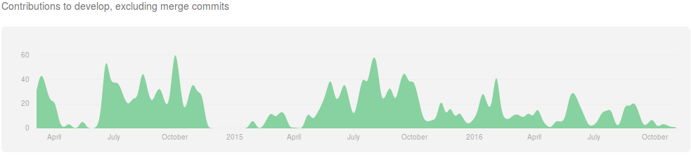

.. header:: SCRAM -- Command-line Risk Analysis Multi-tool
.. footer:: © 2016, Olzhas Rakhimov, CC BY-SA 4.0

#####################################
Command-line Risk Analysis Multi-tool
#####################################

SCRAM 0.11.4
============

- Free, *as in free speech*, and open-source software (FOSS) project

    * GPLv3 license
    * Only FOSS dependencies
    * Modern FOSS languages, libraries, and tools
    * Open standards (OpenPSA MEF, XML, RelaxNG, reST)
    * Modern software development best practices

- `OIN <http://www.openinventionnetwork.com/>`_ licensee (a royalty-free-patent community)
- Available for all major platforms (GNU/Linux, Mac, Windows)
- Documentation website: http://scram-pra.org

History
=======

- Started as a student project in 2014
- Became a personal pet project
- Has been a playground to learn and practice software development
- 2300+ commits
- 20+ releases

Development
===========

- Hosted on GitHub: https://github.com/rakhimov/scram/

- C++14 (~10 KLOC / ~85%)

    * Compilers: GCC 4.9, Clang 3.4, Intel 17.0.1
    * Dependencies: CMake, Boost, LibXML++, Qt 5, TCMalloc or JEMalloc

- Python (~2 KLOC / ~15%)

    * 2.7
    * 3.3+

- Documentation Driven Development

    * The documentation source text in reStructuredText_ format
    * C++ documentation with Doxygen_

- Test Driven Development
- Design by Contract
- Policy-based design
- Defensive programming
- Analysis validation with XFTA

.. _reStructuredText: http://docutils.sourceforge.net/rst.html

Quality Assurance
=================

#. Source code management and version control with Git_
#. Consistent coding styles based on Google C++ and Python Style Guides
#. Automated tests with GoogleTest_ and Nose_
#. Continuous integration with `Travis CI`_ and AppVeyor_
#. Automated documentation generation with Doxygen_ and Sphinx_

.. _Git: https://git-scm.com/
.. _GoogleTest: https://github.com/google/googletest
.. _Nose: https://nose.readthedocs.org/en/latest/
.. _Travis CI: https://travis-ci.org/
.. _AppVeyor: https://ci.appveyor.com/
.. _Doxygen: http://doxygen.org/
.. _Sphinx: http://sphinx-doc.org/

C++
---

#. Performance profiling with ``Gprof``, Valgrind_, and ``perf``
#. Code coverage check with Gcov_ and reporting with Coveralls_
#. Memory management bugs and leaks with Valgrind_
#. Static code analysis with Coverity_ and CppCheck_
#. Cyclomatic complexity analysis with Lizard_
#. Google style conformance check with Cpplint_
#. Common C++ code problem check with cppclean_
#. Consistent code formatting with ClangFormat_
#. Component dependency analysis with cppdep_

.. _Gcov: https://gcc.gnu.org/onlinedocs/gcc/Gcov.html
.. _Coveralls: https://coveralls.io/
.. _Valgrind: http://valgrind.org/
.. _Coverity: https://scan.coverity.com/projects/2555
.. _CppCheck: https://github.com/danmar/cppcheck/
.. _Lizard: https://github.com/terryyin/lizard
.. _Cpplint: https://github.com/theandrewdavis/cpplint
.. _cppclean: https://github.com/myint/cppclean
.. _ClangFormat: http://clang.llvm.org/docs/ClangFormat.html
.. _cppdep: https://pypi.python.org/pypi/cppdep

Quality Assurance (cont.)
=========================

Python
------

#. Code quality and style check with Pylint_
#. Profiling with PyVmMonitor_
#. Code coverage check with coverage_ and reporting with Codecov_
#. Continuous code quality control on Landscape_ with Prospector_

.. _Pylint: http://www.pylint.org/
.. _PyVmMonitor: http://www.pyvmmonitor.com/
.. _coverage: http://nedbatchelder.com/code/coverage/
.. _Codecov: https://codecov.io/
.. _Landscape: https://landscape.io/
.. _Prospector: https://github.com/landscapeio/prospector

Targets
-------

====================   ==================   ==================
Metric                 Before Release       On Release
====================   ==================   ==================
C++ Code Coverage      80%                  95%
C++ Defect Density     0.5 per 1000 SLOC    0.35 per 1000 SLOC
CCN                    15                   15
Python Code Coverage   80%                  95%
Pylint Score           9.0                  9.5
Documentation          Full                 Full
====================   ==================   ==================

Implemented Features in SCRAM 0.11.4
====================================

#. Static fault tree analysis

    * MOCUS
    * BDD (default)
    * ZBDD

#. Non-coherent model analysis

    * Minimal Cut Sets
    * Prime Implicants

#. Analysis with common-cause failure models
#. Probability calculations with importance analysis
#. Uncertainty analysis with Monte Carlo simulations
#. Fault tree generator
#. The shorthand format to the MEF converter

Performance
===========

#. Prefer code quality, clarity, simplicity, elegance over performance
#. Trade memory for speed

Baobab 1
--------

No cut-off, all 46,188 MCS.

+--------------+--------+-------+-------+
|              | MOCUS  | ZBDD  | BDD   |
+==============+========+=======+=======+
| Time, s      | 0.35   | 0.16  | 0.10  |
+--------------+--------+-------+-------+
| Memory, MiB  | 23     | 25    | 23    |
+--------------+--------+-------+-------+

CEA9601
-------

+-------------------------------------------------+
| BDD                                             |
+================+========+===========+===========+
| Cut-off order  | 4      | 5         | 6         |
+----------------+--------+-----------+-----------+
| MCS            | 54,436 | 1,615,876 | 9,323,572 |
+----------------+--------+-----------+-----------+
| Time, s        | 1.6    | 3.4       | 12.6      |
+----------------+--------+-----------+-----------+
| Memory, MiB    | 215    | 310       | 1,350     |
+----------------+--------+-----------+-----------+

.. class:: comment

*System specs: Core i7-2820QM, Ubuntu 16.04 x64, GCC 5.4.1, Boost 1.58, TCMalloc 2.4*

OpenPSA MEF in SCRAM 0.11.4
===========================

#. Label
#. Attributes
#. Public and Private Roles
#. Fault Tree Layer

    * Components
    * Basic events
    * House events (Boolean constant)
    * Gates (nested formula)

#. Model Data
#. Common Cause Failure Groups (beta-factor, MGL, alpha-factor, phi-factor)
#. Parameters
#. Expressions

    * Constant expressions, System mission time, Parameter
    * Random deviate (normal, log-normal, histogram, uniform, gamma, beta)
    * Built-in expressions (exponential with 2 or 4 parameters, Weibull)

Issues with the MEF
===================

#. Minor errors in the MEF specification, the BNF or DTD schema
#. The location of the Model Data
#. The 'include' feature

    * Problems with automatic validation with the schema
    * Semantics with public and private roles

#. Unspecified constraints on the name and reference formats

    * Problems with porting input files from one software to another

Challenges
==========

'atleast' gate
--------------

#. Many names: Vote, Voting, Voting-OR, Combination, Combo, atleast, K/N, N-OR-MORE
#. API (Atleast vs. AtLeast vs. atleast vs. at_least)

XML report file size
--------------------

- ~50x compression with ``gzip``
- Reading with SAX parsers
- HDF5 or SQL database as an alternative
- Some binary format based on ZBDD serialization (probably, the most space efficient)

+-------------------------------------------------+
| CEA9601 Report                                  |
+================+========+===========+===========+
| Cut-off order  | 4      | 5         | 6         |
+----------------+--------+-----------+-----------+
| MCS            | 54,436 | 1,615,876 | 9,323,572 |
+----------------+--------+-----------+-----------+
| Reporting, s   | < 0.05 | 2.6       | 17.5      |
+----------------+--------+-----------+-----------+
| XML size, MB   | 9.3    | 329       | 2,200     |
+----------------+--------+-----------+-----------+

INHIBIT gate
------------

.. code-block:: xml

  <define-gate name="Gate">
    <attributes>
      <attribute name="flavor" value="inhibit"/>
    </attributes>
    <and>
      <event name="ConditionalEvent"/>
      <!-- argument events ... -->
    </and>
  </define-gate>

CONDITIONAL event
-----------------

.. code-block:: xml

  <define-basic-event name="ConditionalEvent">
    <attributes>
      <attribute name="flavor" value="conditional"/>
    </attributes>
    <float value="0.4"/>
  </define-basic-event>

UNDEVELOPED event
-----------------

.. code-block:: xml

  <define-basic-event name="Undeveloped">
    <attributes>
      <attribute name="flavor" value="undeveloped"/>
    </attributes>
    <float value="0.5"/>
  </define-basic-event>

.. raw:: pdf

    PageBreak

Report CCF events in products
-----------------------------

.. code-block:: xml

  <results>
    <sum-of-products name="TopEvent" basic-events="6" products="6">
      <product order="2">
        <ccf-event ccf-group="Pumps" order="1" group-size="2">
          <basic-event name="PumpTwo"/>
        </ccf-event>
        <!-- ... -->
      </product>
    <!-- ... -->
    </sum-of-products>
  </results>

.. raw:: pdf

    PageBreak

Report importance factors
-------------------------

.. code-block:: xml

  <results>
    <importance name="TopEvent" basic-events="4">
      <basic-event name="Pump" MIF="0.4" CIF="0.4" DIF="0.8" RAW="1.2" RRW="1.7"/>
      <basic-event name="Valve" MIF="0.4" CIF="0.4" DIF="0.8" RAW="1.2" RRW="1.7"/>
      <!-- ... -->
    </importance>
  </results>

.. raw:: pdf

    PageBreak titlePage

.. class:: title

Proposals to the OpenPSA MEF

.. raw:: pdf

    PageBreak cutePage

Host the MEF standard on GitHub
===============================

For the OpenPSA
---------------

#. The organization: https://github.com/open-psa/
#. Easy collaboration
#. Issue tracking
#. Free web-site hosting
#. Many more free perks for the project

For the Community
-----------------

#. SCRAM and other FOSS projects as test-beds and early feedback for MEF features
#. Scripts to convert inputs from other formats to the MEF
#. Move the validation schema from SCRAM to the MEF public repository
#. Provide validation input (fault tree, event tree, etc.) for implementers

Extra
-----

#. Mailing lists for discussions (e.g., Google groups)

Specification for the Name format
=================================

#. Case-sensitive or case-agnostic (simplifies code for l10n/i18n)
#. Insensitive to leading and trailing whitespace characters (trim)
#. Consistent with `XML NCName datatype`_

    * The first character must be alphabetic.
    * May contain alphanumeric characters and special characters like ``_``, ``-``.
    * No whitespace or other special characters like ``:``, ``,``, ``/``, etc.

#. No double dashes ``--``
#. No trailing dash
#. No periods ``.``

    * Reserved for the Reference format, i.e., ``fault_tree.component.event``

.. _XML NCName datatype:
    http://stackoverflow.com/questions/1631396/what-is-an-xsncname-type-and-when-should-it-be-used

.. code-block:: xml

  <define name="Identifier">
    <data type="NCName">
      <param name="pattern">[^\-.]+(-[^\-.]+)*</param>
    </data>
  </define>

RelaxNG instead of the DTD schema
=================================

* DTD schema issue: Boolean operators vs. Gate formulae (and, or, not)
* Simpler and more powerful than the DTD
* Automated conversion to ``XSD`` with trang_
* It's ready:
  `MEF RelaxNG Schema <https://github.com/rakhimov/scram/blob/master/share/open-psa/mef.rng>`_,
  `MEF RelaxNG Compact Schema <https://github.com/rakhimov/scram/blob/master/share/open-psa/mef.rnc>`_

*RelaxNG*

.. code-block:: xml

  <define name="gate-definition">
    <element name="define-gate">
      <ref name="name"/>
      <optional> <ref name="role"/> </optional>
      <optional> <ref name="label"/> </optional>
      <optional> <ref name="attributes"/> </optional>
      <ref name="formula"/>
    </element>
  </define>

*RelaxNG Compact (looks like BNF)*

.. code-block:: rnc

  gate-definition =
    element define-gate { name, role?, label?, attributes?, formula }

Other Proposals
===============

#. The MEF standard source text in reStructuredText_ format

    * Automated conversion to ``html``, ``LaTeX``, ``pdf``, ...
    * Easy to learn and work with (in comparison to ``LaTeX``)

#. Removal of the 'include' specification

    * XInclude
    * Multiple input file processing as an alternative

#. Incorporation of dynamic fault trees (PAND, SEQ, FDEP, SPARE)

#. Specification for floating-point number format

    * The decimal separator ``.`` (dot) regardless of the locale
    * The scientific notation with ``e`` or ``E`` for the exponent

.. _trang: http://www.thaiopensource.com/relaxng/trang.html

.. raw:: pdf

    PageBreak endPage

.. class:: title

"Nothing is worse than having an itch you can never scratch."

.. class:: attribution

-- Leon Kowalski, *Blade Runner*
